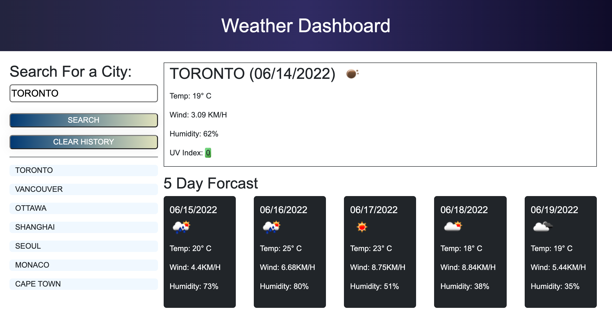
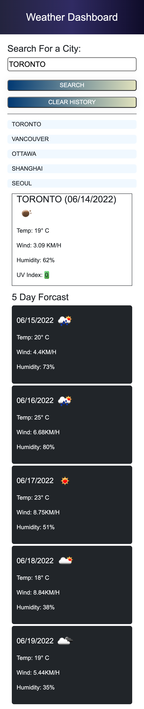

# Weather Dashboard

## Table of Contents

* [Description](#description)
* [Technologies](#technologies)
* [Setup](#setup)
* [Webpage Demo](#webpage-demo)

---

## Description

The purpose of this project is create a weather dashboard to showcase my skills working with third party APIs.

---

## Technologies

* HTML5
* CSS
* Javascript
* jQuery
* Bootstrap
* Moment.js

---

## Setup

* To run this project clone the repository and open in your prefered code editor. Open index.html in your browser.
* Enter a city in the search bar to get the current weather and 5 day forcast for that city.

---

## Webpage Demo

Link to webpage: [**Weather Dashboard**](https://jarydknight.github.io/weather-dashboard/)

### Desktop:
 

### Mobile:
